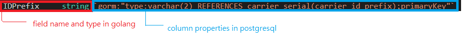

# Mcom Models

## Find all models

1. Find `Model` interface in `mcom\impl\orm\models\models.go`

   ```go
   // Model definition
   type Model interface {
    Model()
    schema.Tabler
   }
   ```

2. Go to implementations of the interface (<kbd>CTRL</kbd>+<kbd>F12</kbd> in VSCode)

## About Gorm models

Reference: [Gorm docs](https://gorm.io/docs/models.html)

`Carrier` struct as shown below is one of the models in mcom.

```go
// Carrier is carrier definition. The ID is the IDPrefix+SerialNumber
type Carrier struct {
 IDPrefix     string `gorm:"type:varchar(2) REFERENCES carrier_serial(carrier_id_prefix);primaryKey"`
 SerialNumber int32  `gorm:"type:integer;primaryKey"`
 // DepartmentOID relative to Department.OID shows which department the carrier belongs to.
 DepartmentOID   string `gorm:"column:department_oid;type:text;not null"`
 AllowedMaterial string `gorm:"type:varchar(20);not null"`
 Deprecated      bool   `gorm:"default:false;not null"`
 // Contents relative to MaterialResource.OID.
 Contents  pq.StringArray `gorm:"type:uuid[];not null;default:'{}'"`
 UpdatedAt types.TimeNano `gorm:"autoUpdateTime:nano;not null"`
 UpdatedBy string         `gorm:"type:text;not null"`
 CreatedAt types.TimeNano `gorm:"autoCreateTime:nano;not null"`
 CreatedBy string         `gorm:"type:text;not null"`
}

// Model implements "gitlab.kenda.com.tw/kenda/mcom/impl/orm/models" Model interface
func (*Carrier) Model() {}

// TableName implements "gitlab.kenda.com.tw/kenda/mcom/impl/orm/models" Model interface
func (*Carrier) TableName() string {
 return "carrier"
}

// MigrateFunction implements "gitlab.kenda.com.tw/kenda/mcom/impl/orm/models"
// Function interface
func (*Carrier) MigrateFunction(db *gorm.DB) error {
 sql := strings.Join([]string{
  "CREATE OR REPLACE FUNCTION fill_in_carrier_serial_number() RETURNS trigger",
  "    LANGUAGE plpgsql",
  "    AS $$",
  "begin",
  "  NEW.serial_number := nextval('carrier_seq_' || FORMAT('%s_%s',ASCII(SUBSTRING(NEW.id_prefix,1,1)),ASCII(SUBSTRING(NEW.id_prefix,2,2))));",
  "  RETURN NEW;",
  "end",
  "$$;",
 }, "\n")
 return db.Exec(sql).Error
}

// MigrateTrigger implements "gitlab.kenda.com.tw/kenda/mcom/impl/orm/models"
// Trigger interface
func (*Carrier) MigrateTrigger(db *gorm.DB) error {
 if err := db.Exec("DROP TRIGGER IF EXISTS fill_in_carrier_serial_number on carrier;").Error; err != nil {
  return err
 }
 return db.Exec("CREATE TRIGGER fill_in_carrier_serial_number BEFORE INSERT ON carrier FOR EACH ROW EXECUTE PROCEDURE fill_in_carrier_serial_number();").Error
}
```

### Implementation Model interface

```go
// Model implements "gitlab.kenda.com.tw/kenda/mcom/impl/orm/models" Model interface
func (*Carrier) Model() {}
```

`Model()`function is not important

```go
// TableName implements "gitlab.kenda.com.tw/kenda/mcom/impl/orm/models" Model interface
func (*Carrier) TableName() string {
 return "carrier"
}
```

corresponding table name in postgresql

### Struct Contents



#### Field Names --> Column Names

Nine times out of ten, field names in mcom would be in **camelCase or PascalCase** and the column name in the postgresql DB would be in **snake_case**.

For example, `SerialNumber` in mcom  --> `serial_number` in postgresql.

Exception: we use gorm tag `column` to specified the column name in some cases .

```go
DepartmentOID   string `gorm:"column:department_oid;type:text;not null"` // the column name will be "department_oid"
```

#### Common gorm tags

| Gorm tags        | SQL          | Description                  |
| ---------------- | ------------ | ---------------------------- |
| column:my_column | "my_column"  | set column name              |
| type:integer     | integer      | set column type              |
| not null         | NOT NULL     |                              |
| default:'{}'     | DEFAULT '{}' |                              |
| primaryKey       |              | set a primary key constraint |

#### Conclusion

Carrier model

```go
// Carrier is carrier definition. The ID is the IDPrefix+SerialNumber
type Carrier struct {
 IDPrefix     string `gorm:"type:varchar(2) REFERENCES carrier_serial(carrier_id_prefix);primaryKey"`
 SerialNumber int32  `gorm:"type:integer;primaryKey"`
 // DepartmentOID relative to Department.OID shows which department the carrier belongs to.
 DepartmentOID   string `gorm:"column:department_oid;type:text;not null"`
 AllowedMaterial string `gorm:"type:varchar(20);not null"`
 Deprecated      bool   `gorm:"default:false;not null"`
 // Contents relative to MaterialResource.OID.
 Contents  pq.StringArray `gorm:"type:uuid[];not null;default:'{}'"`
 UpdatedAt types.TimeNano `gorm:"autoUpdateTime:nano;not null"`
 UpdatedBy string         `gorm:"type:text;not null"`
 CreatedAt types.TimeNano `gorm:"autoCreateTime:nano;not null"`
 CreatedBy string         `gorm:"type:text;not null"`
}
```

will be converted to sql table as shown below.

```sql
CREATE TABLE "carrier" (
 "id_prefix" varchar(2) NOT NULL, 
 "serial_number" integer NOT NULL, 
 "department_oid" text NOT NULL, 
 "allowed_material" varchar(20) NOT NULL, 
 "deprecated" boolean NOT NULL DEFAULT false, 
 "contents" uuid[] NOT NULL DEFAULT '{}'::uuid[], 
 "updated_at" bigint NOT NULL, 
 "updated_by" text NOT NULL, 
 "created_at" bigint NOT NULL, 
 "created_by" text NOT NULL,
 CONSTRAINT "carrier_pkey" PRIMARY KEY ("id_prefix", "serial_number"), 
 FOREIGN KEY ("id_prefix")
  REFERENCES "olive_sub_test"."carrier_serial" ("carrier_id_prefix")
  ON UPDATE NO ACTION ON DELETE NO ACTION
)
```

### Functions

```go
// MigrateFunction implements "gitlab.kenda.com.tw/kenda/mcom/impl/orm/models"
// Function interface
func (*Carrier) MigrateFunction(db *gorm.DB) error {
 sql := strings.Join([]string{
  "CREATE OR REPLACE FUNCTION fill_in_carrier_serial_number() RETURNS trigger",
  "    LANGUAGE plpgsql",
  "    AS $$",
  "begin",
  "  NEW.serial_number := nextval('carrier_seq_' || FORMAT('%s_%s',ASCII(SUBSTRING(NEW.id_prefix,1,1)),ASCII(SUBSTRING(NEW.id_prefix,2,2))));",
  "  RETURN NEW;",
  "end",
  "$$;",
 }, "\n")
 return db.Exec(sql).Error
}
```

string in `db.Exec()`

```sql
CREATE OR REPLACE FUNCTION fill_in_carrier_serial_number()
 RETURNS trigger
 LANGUAGE plpgsql
AS $function$
begin
  NEW.serial_number := nextval('carrier_seq_' || FORMAT('%s_%s',ASCII(SUBSTRING(NEW.id_prefix,1,1)),ASCII(SUBSTRING(NEW.id_prefix,2,2))));
  RETURN NEW;
end
$function$
```

### Triggers

```go
// MigrateTrigger implements "gitlab.kenda.com.tw/kenda/mcom/impl/orm/models"
// Trigger interface
func (*Carrier) MigrateTrigger(db *gorm.DB) error {
 if err := db.Exec("DROP TRIGGER IF EXISTS fill_in_carrier_serial_number on carrier;").Error; err != nil {
  return err
 }
 return db.Exec("CREATE TRIGGER fill_in_carrier_serial_number BEFORE INSERT ON carrier FOR EACH ROW EXECUTE PROCEDURE fill_in_carrier_serial_number();").Error
}
```

string in `db.Exec()`

```sql
CREATE TRIGGER "fill_in_carrier_serial_number"
 BEFORE INSERT
 ON carrier
 FOR EACH ROW
 EXECUTE FUNCTION fill_in_carrier_serial_number();
```
