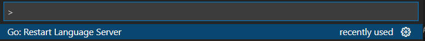
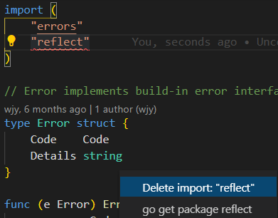
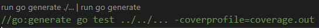

# Mcom Development Tutorials

## Abstract

旨在簡要快速地說明mcom的架構並示範如何新增/修改mcom專案的功能。

## Prerequisite

- Installations
  - [Go 1.15](https://golang.org/dl/)
  - [Proto Buffer](https://gitlab.kenda.com.tw/gogogo/go-protobuf/-/wikis/Install/00-Install#%E5%AE%89%E8%A3%9D)

## About mcom

首先簡要說明一下mcom的專案結構

在mcom專案底下可以看到類似下方結構

```powershell
PS mcom>tree
D:.
├─assets
│  ├─.ignore
│  └─docs
│      └─images
├─cmd
│  ├─mockgenerator
│  └─sync-table-schema
├─errors
├─impl
│  ├─orm
│  │  └─models
│  └─pda
├─mock
└─utils
    ├─resources
    ├─roles
    ├─sites
    ├─stations
    └─types

PS mcom> Get-ChildItem -file|Select-Object Name

Name
----
.gitignore
.gitlab-ci.yml
coverage.out
dm.go
go.mod
go.sum
material_control.go
production_plan.go
products.go
README.md
recipes.go
record.go
resources.go       
resources_test.go
stations.go
users.go
users_test.go
warehouse.go
workorders.go
```

從最外層開始挑重點說明

[mcom](../../):

- [.gitignore](../../.gitignore): mcom 專案git忽略[assets/.ignore](../.ignore/)底下的內容

- [dm.go](../../dm.go):  內涵interface `DataManager` 用於定義mcom專案主要的對外方法
- other golang source files: 例如[material_control.go](../../material_control.go) [production_plan.go](../../production_plan.go) 等等，主要用於定義對外Request/Response的結構，或者與其關聯的結構和方法。

---

[mcom\assets](../): 放文件，templates或其他資源檔

- [.ignore](../.ignore/): git ignore
- [docs](../docs/):放各式文件

---

[mcom\cmd](../../cmd/): 放可直接執行的程式

---

[mcom\errors](../../errors/): 定義mcom的各式錯誤訊息

---

[mcom\impl](../../impl/): mcom功能實作及測試

- [orm\models](../../impl/orm/models/):定義資料庫的table結構

---

[mcom\mock](../../mock/): 前端測試呼叫mcom時，若無需實際操作資料庫則會呼叫這裡的方法

---

[mcom\utils](../../utils): 在這裡定義各種列舉

## Example - Add a new method in DataManager

### Define the method in dm.go

在`dm.go`裡面有一個`DataManager`的介面定義，只要將新的方法加入其中即可

```go
type DataManager interface{
    //...
    
    // add your method like this
    NewMethod(ctx context.Context, req NewMethodRequest)(NewMethodReply, error)
}
```

在`DataManager`中定義方法請盡量遵守以下原則:

1. 當無法從argument的型別判別其作用時(例如`string` `int`等等)，請進行命名，其他情況隨意

2. 第一個argument永遠是`context.Context`

3. 最後一個output永遠是`error`

4. 承第二點和第三點，方法盡量有**一個以上**的輸入/輸出

5. output數量不要超過兩個

6. 輸入輸出中如果需要定義新結構請將其放在`mcom\`底下，並且實作`Request` interface

   例如:

   ```go
   // mcom\my_new_method.go
   package mcom
   
   type NewMethodRequest struct{
       //...
   }
   ```

7. 文件中須註明**request中不可缺少的內容**以及**可能回傳的error**

8. 若List方法有包含分頁或排序功能，需實作`Sliceable` `Orderable` interface，並將對應的request/reply包含於方法的request/reply之中

定義完interface後，需在兩個地方(package)實作方法，分別是 impl 以及 mock

### Mocking

mock 方法實作可以透過`mcom\cmd\mockgenerator`來自動生成

執行`go generate`

```pow
PS mcom\cmd\mockgenerator> go generate .
```

或執行`main.go`即可

```powershell
PS mcom\cmd\mockgenerator> go run .\main.go
```

如果無法順利生成 mock 實作，請回頭檢查您的方法是否符合[相關規範](#define-the-method-in-dmgo)

### Implementation

在`mcom\impl`裡面建立新的golang source file實作方法內容

要點:

- 資料庫相關的操作請透過[Gorm](https://github.com/go-gorm/gorm)進行

- 習慣上會將import的內容區分成四個區塊，分別是

  1. 官方提供的package
  2. 第三方提供的package
  3. 建大其他專案的package
  4. mcom專案內部的其他package

  ```go
  import (
   "context"
   "testing"
   "time"
  
   "github.com/stretchr/testify/assert"
   "gorm.io/gorm"
  
   pbWorkOrder "gitlab.kenda.com.tw/kenda/commons/v2/proto/golang/mes/v2/workorder"
  
   "gitlab.kenda.com.tw/kenda/mcom"
   mcomErr "gitlab.kenda.com.tw/kenda/mcom/errors"
   "gitlab.kenda.com.tw/kenda/mcom/impl/orm/models"
   "gitlab.kenda.com.tw/kenda/mcom/utils/resources"
  )
  ```

- 習慣上，為了區分mcom的errors與go的errors，我們會給`mcom/errors`一個alias : `mcomErr`

- 習慣上，為了區分commons的context與go的context，我們會給`commons/v2/utils/context`一個alias : `commonsCtx`

視需求可以:

- [新增資料庫模型](#example-create-a-new-gorm-model)
- [定義列舉](#example-add-a-new-enum)
- [定義錯誤碼](#example-add-a-new-error-code)

### Testing

#### mcom

`Request`測試統一寫在`request_test.go`

其他測試則寫在各自的`xxx_test.go`

#### impl

原則上`DataManager`的實作都要有對應測試，source file的命名就是實作的檔名加上`_test.go`，例如在`xxx.go`實作功能，那單元測試就寫在`xxx_test.go`上面。

## Example - create a new gorm model

### Declaring models

寫在`mcom\impl\orm\models`裡面，寫法請請參考[官方文件](https://gorm.io/docs/models.html)

### Implement `Model` interface

實作位於`mcom\impl\orm\models\models.go`的`Model` interface

### Auto migrate tables

為了在測試階段自動生成相應的table到PostgreSQL裡面，必須將剛才寫的model新增到`mcom\impl\impl.go`裡面`DataManager`的`autoMigrateTables()`方法中。

例如:

```go
// autoMigrateTables see autoMigrateTables comment for details.
func (dm *DataManager) autoMigrateTables() error {
 return autoMigrateTables(
  dm.db,

  //...
        //add your model here
        &models.MyModel{},
 )
}
```

**注意**: 方法必須先[實作`Model`interface](#implement-model-interface) 才能放入`autoMigrateTables()`

## Example - add a new enum

寫在`mcom\utils\`底下，先定義proto buffer，再生成golang的source code，可以參考[mcom\utils\stations\stations.proto](https://gitlab.kenda.com.tw/kenda/mcom/-/blob/develop/utils/stations/stations.proto)

註：必須先[安裝Protobuf](#prerequisite)

## Example - add a new error code

在`mcom\errors\code.proto`中找到`enum Code`將想要新增的錯誤名稱以及代碼寫入其中，接著執行`go generate` 或 `protoc --go_out=paths=source_relative:. code.proto`，確認`mcom\errors\code.pb.go`有生成對應的error即可使用。

註：必須先[安裝Protobuf](#prerequisite)

## Notices

### About Context

為了避免忘記呼叫`WithContext()`方法導致無法順利追蹤LOG，在DataManager的方法實作中(不包含測試)統一使用確定帶有Context的結構來與資料庫溝通，請注意以下兩點:

1. 使用到`gorm.DB`的方法時，請使用`session.db`或`tx.db`，避免使用`dm.db`。
2. 同樣的，在定義私有方法時，盡量定義成`session`或`txDataManager`的方法。

### For VSCode Developers

這邊補充說明以[VSCode](https://code.visualstudio.com/docs)開發Golang專案的注意事項，不使用VSCode可以跳過

需要的Extensions可以參考[Vscode提供的資訊](https://code.visualstudio.com/docs/languages/go)

疑難雜症

| 症狀                                                         | 解法                                                         |
| ------------------------------------------------------------ | ------------------------------------------------------------ |
| 明明沒有錯誤，或錯誤已被修正但VSCode卻以黃色或紅色波浪底線提示錯誤(常見於go get之後依然顯示未找到參考) | <kbd>ctrl</kbd>+<kbd>shift</kbd>+<kbd>P</kbd>找到這一項並執行 |

小技巧:

1. import 套件後可以點旁邊的小燈泡直接執行go get

   

   - v1.15版本的Go，如果需要get特別的套件版本，還是必須手動下指令

2. `//go:generate`上方會有兩個小按鈕點下去可以直接執行

   

## References

這裡列一些 Merge Request 供參考

- [Batch 功能實作](https://gitlab.kenda.com.tw/kenda/mcom/-/merge_requests/55):
  - `DataManager`方法定義、實作
  - error code 新增
- [Carrier 功能實作](https://gitlab.kenda.com.tw/kenda/mcom/-/merge_requests/72):
  - model 定義
  - `DataManager`方法定義、實作
  - error code 新增
